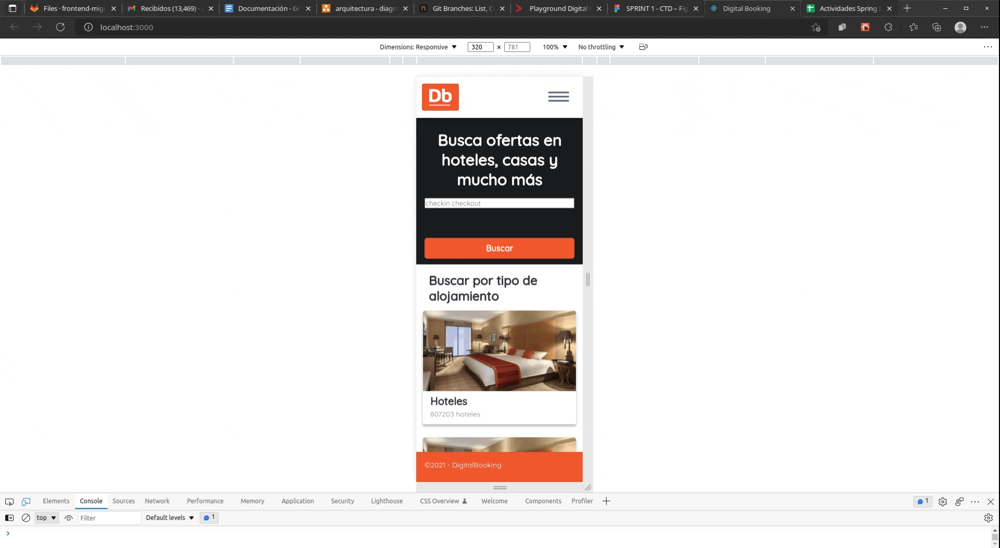
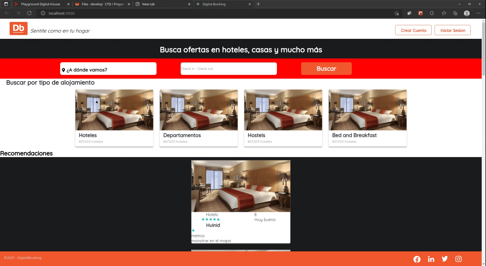
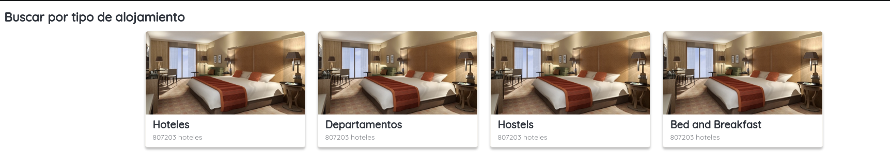
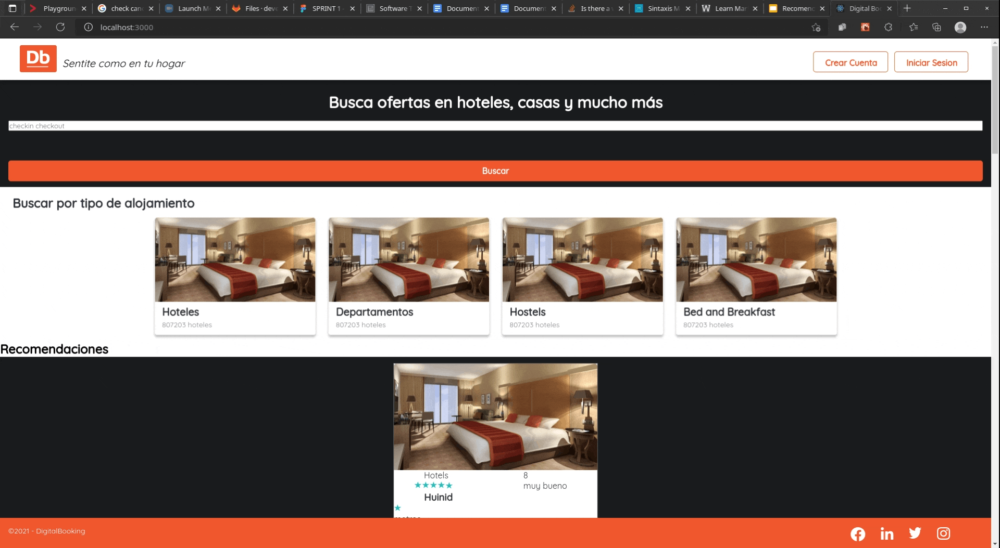

# **Casos de prueba**

### - C-001 - Sitio web responsive

##### Descripción:
Validación de la configuración visual de la página según el formato de la pantalla (móvil, tablet o desktop)

#### Estado de ejecución - PASS  

## - C-002 - Funcionamiento de la API

#### Estado de ejecución - PASS  

##### Descripción: 
Validación de funciones CRUD en la API del backend.

## - C-003 - Característica Buscador

#### Estado de ejecución - PASS  

##### Descripción: 
Validación de funciones CRUD en la API del backend.

## - C-004 - Característica bloque listado Productos

#### Estado de ejecución - PASS 

##### Descripción: 
Validación de  implementación del bloque listado de productos.

## - C-005 - Característica bloque de categorías

#### Estado de ejecución - PASS  

##### Descripción: 
Validación de  implementación del bloque Categoría.

## - C-006 - Característica login y registro

#### Estado de ejecución

### Prueba L&F - PASS 

### Prueba Funcional - FAIL  

##### Descripción: 
Validación de implementación del template de login y registro.

**Registro:**

**Login:**

